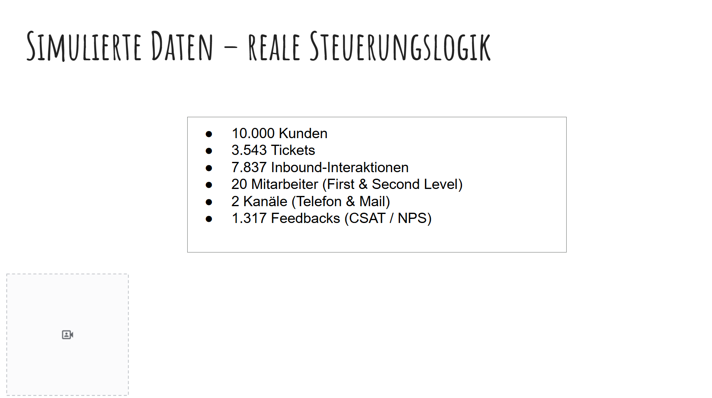
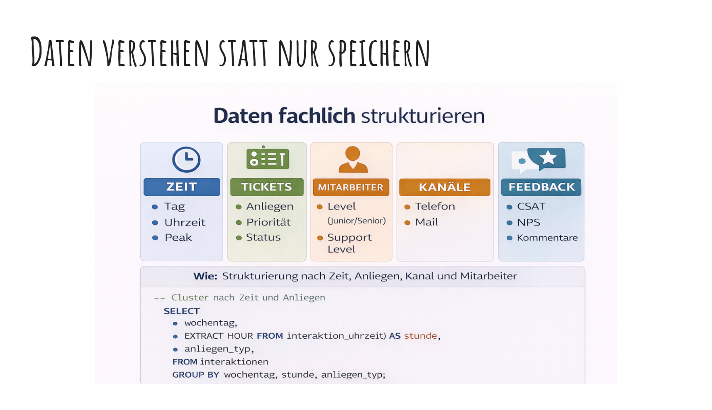
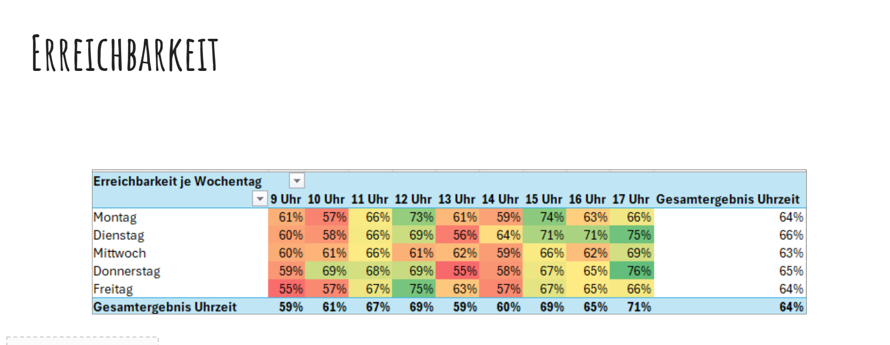
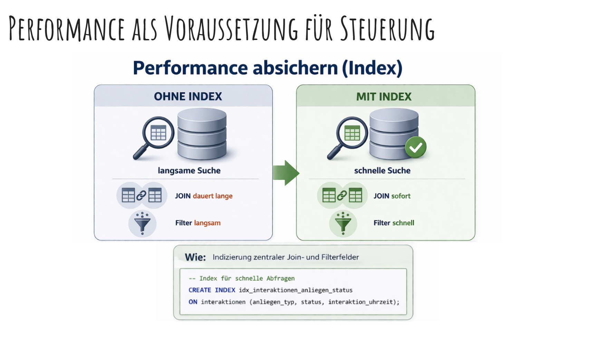

# Happy Sunshine – SQL Customer Service Analytics

## Projektbeschreibung
Dieses Projekt simuliert eine professionelle Kundenservice-Analyse für ein Energieunternehmen.

Ziel ist es, Transparenz über Servicequalität, Ticketvolumen und operative Engpässe zu schaffen.

Analysiert werden:

- Ticketvolumen  
- Backlog  
- Eskalationen  
- Erreichbarkeit  
- Bearbeitungszeiten  
- Kundenzufriedenheit (CSAT / NPS)  

---

## Verwendete Tools

- PostgreSQL  
- SQL  
- Excel  
- Power Query  
- GitHub  

---

## Projektstruktur

```bash
/sql          # SQL-Skripte
/data         # Beispieldaten / CSV-Dateien
/docs         # Dokumentation / KPI-Erklärung
/screenshots  # Dashboard / Bilder


## Projektüberblick


## Daten fachlich strukturieren


## KPI Analyse – Erreichbarkeit


## Performance Optimierung


## Business-Kontext

Das Projekt basiert auf meiner Erfahrung als Customer Service & Operations Leader.

Ich betrachte Kennzahlen aus Managementsicht und leite daraus Maßnahmen für:

- Teamführung  
- Prozessoptimierung  
- Servicequalität  
- Ressourcenplanung  
- Performance-Steigerung  

ab.
